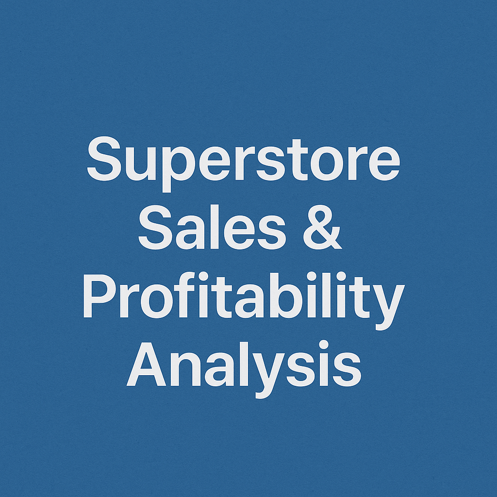

# 📊 Superstore Sales Analysis



---

## 📑 Overview

This project performs a comprehensive sales analysis on the **Superstore dataset**, identifying key business insights, profitability trends, and customer behavior patterns through data visualization and exploratory data analysis (EDA).  

The goal is to assist business stakeholders in making data-driven decisions to improve sales strategies, optimize shipping operations, and boost overall profitability.

---


The project covers:
- Sales trends over time
- Profitability by region, category, and customer segment
- Impact of discount rates on profitability
- Top-selling and most profitable products
- Shipping performance analysis

  

## 📂 Project Structure

Superstore-Sales-Analysis/
│

├── Visuals/ # Visualizations (PNG)

│

├── Sample - Superstore.csv # Original dataset

├── superstore_cleaned.csv # Cleaned dataset

│

├── superstore_Analysis.ipynb # Jupyter Notebook analysis

├── app.py # Streamlit/Dashboard app (if applicable)
│

├── requirements.txt # Required Python libraries

├── Superstore_Sales_Profitability_Report.pdf # Final report (PDF)
│

├── superstore-sales-analysis.png # Banner image for README

│

└── README.md # Project documentation


---


## 📁 Dataset

- **Sample - Superstore.csv**: Raw dataset
- **superstore_cleaned.csv**: Cleaned and processed version used for analysis

Source: 📊 Sample Superstore Data (commonly used in analytics projects)


---

## 📊 Key Visualizations

- **Monthly Sales and Profit Trends**
- **Profit by Category, Sub-Category, and Region**
- **Discount vs Profit Analysis**
- **Top 10 Profitable Products**
- **Sales Distribution by Ship Mode**
- **Correlation Heatmap**

All visuals are available in the `Visuals/` folder.

---

## 📝 Technologies Used

- **Python**
- **Pandas**
- **NumPy**
- **Matplotlib**
- **Seaborn**
- **Jupyter Notebook**
- **Streamlit (for app)**
- **Git & GitHub**

---

## 📈 Insights & Findings

- 📌 **Most profitable category**: Technology  
- 📌 **Least profitable region**: South  
- 📌 Higher discounts often resulted in decreased profitability.
- 📌 First Class shipping mode had better profit margins compared to Same Day.
- 📌 Top 10 products contributed significantly to overall profit.
- 📈 Sales and Profit trends over time identified.
- 📊 Profitability compared by **Region**, **Category**, and **Sub-Category**.
- 🚚 Delivery time trends by different **Ship Modes**.
- 📉 Impact of discounts on profitability visualized.
- 📦 Analysis of customer segments and market behavior.
- 📍 Top-performing US states by sales and profit.

---


📄 Report
A detailed profitability and sales report is available in the project:

Superstore_Sales_Profitability_Report.pdf


## 📖 How to Run

1. **Clone the repository**
   ```bash
   git clone https://github.com/Qazi-Hassan/Superstore-Sales-Analysis.git
   cd Superstore-Sales-Analysis


📬 Contact
For queries or collaboration:

GitHub: Qazi-Hassan
